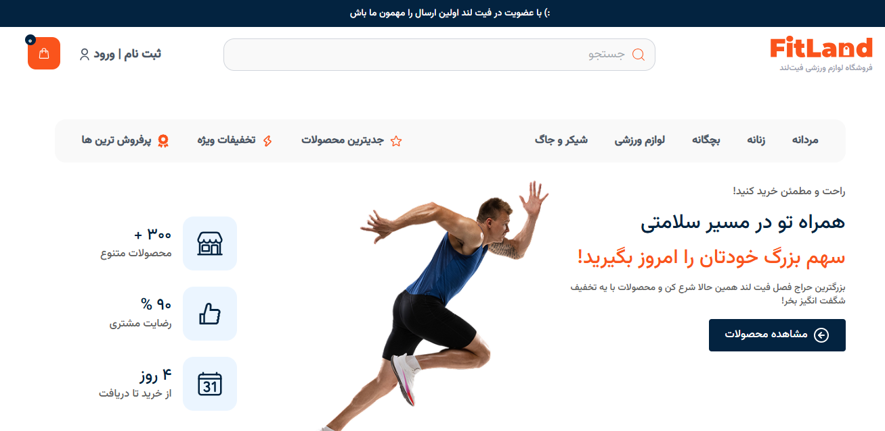

# 🏋️‍♂️ FitLand - Sports Equipment Ecommerce Website

An e-commerce web application for selling sports equipment and apparel, based on a modern Figma UI/UX design.

## 🔧 Tech Stack

- React
- Tailwind CSS
- React Router
- Vite (or CRA)

---

## 📷 Screenshots


---

## 📁 Project Structure
```
src/
├── assets/
├── components/
│   ├── Header
    │   ├── Header.jsx
    │   ├── Logo.jsx
    │   ├── NavLinks.jsx
    │   └── UserActions.jsx 
    │   └── MainHeader.jsx
    │   └── MobileMenu.jsx
    ├── Main
    │   ├── Main.jsx
    │   ├── FitnessEquipment.jsx
    │   ├── NewProducts.jsx
├── pages/
├── layout/
├── routes/
├── utils/

```

## 📌 Features

- Fully responsive
- Home, Shop, Product Detail, Cart, Checkout pages
- Dynamic product cards
- Filter and search
- Add to cart and cart preview

## 🔜 In Progress

- Product filtering by category
- Authentication
- Payment integration
